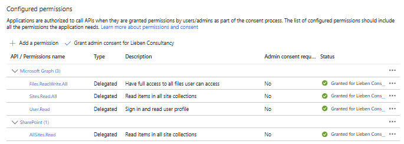
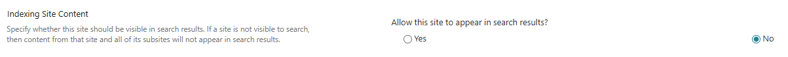

# M365AutoLink
M365AutoLink automatically finds all Microsoft Teams and SharePoint sites you have access to and creates shortcuts to them in your OneDrive, making them available in your file explorer.

There are two versions of the script:

| | **M365AutoLink.ps1** (User) | **M365AutoLink_Centralized.ps1** (Admin) |
|---|---|---|
| **Runs as** | The logged-in user (delegated) | Managed Identity or App Registration (application) |
| **Intended for** | Logon scripts / end-user self-service | Scheduled tasks, Azure Automation, Azure Functions |
| **Site discovery** | `sites?search=*` (delegated) | Enumerates all tenant sites + per-user permission check |
| **Targets** | Current user only | Any/all users (group, list, or tenant-wide) |
| **Auth** | Browser-based OAuth / refresh token | Managed Identity, or certificate-based client credentials |


# Features
- **Saves Time**: Instantly links all your collaborative spaces to your OneDrive.
- **Organization**: Creates a dedicated folder (default: "AutoLink") in your OneDrive root for all shortcuts.
- **Silent Operation**: Caches authentication tokens so subsequent runs can happen silently in the background.
- **Smart Filtering**: Includes configuration to exclude specific site patterns (e.g. personal sites).
- **Centralized Mode**: Process multiple users from a single server-side run without requiring user interaction.
- **Permission-Aware**: Only creates shortcuts for libraries the user actually has access to (View or Edit).
- **Automatic Cleanup**: Removes obsolete shortcuts when a user loses access to a site.

---

# User Version (`M365AutoLink.ps1`)

## Quick Start
1. Download the script [`M365AutoLink.ps1`](https://github.com/jflieben/M365AutoLink/blob/main/M365AutoLink.ps1).
2. [Grant Consent](https://login.microsoftonline.com/organizations/adminconsent?client_id=ae7727e4-0471-4690-b155-76cbf5fdcb30) to the SSO app registration
3. Open a PowerShell terminal (PowerShell 5.x or 7.x).
4. Run the script: 
   ```powershell
   .\M365AutoLink.ps1
   ```
5. Wait for the Onedrive client to sync down the new links

## Configuration
You can edit the `##########START CONFIGURATION##########` block at the top of the script to customize:
- `$FolderName`: The name of the folder created in OneDrive (Default: "AutoLink").
- `$excludedSitesByWildcard`: Patterns for sites to skip.
- `$includedSitesByWildcard`: Patterns for sites to include.
- `$maxFileCount`: Only create a link if the site has less than this amount of files.
- `$minFileCount`: Only create a link if the site has more than this amount of files.
- `$linkNameReplacements`: An array of find/replace patterns applied to shortcut names after creation (see [Link Name Cleanup](#link-name-cleanup)).

## Authentication & Permissions

### Automatic App Registration (easiest)
You can consent to the "Lieben Consultancy" multi-tenant app:
[Grant Consent](https://login.microsoftonline.com/organizations/adminconsent?client_id=ae7727e4-0471-4690-b155-76cbf5fdcb30)

These are delegated permissions only, and thus 100% safe.


### Manual App Registration
If you don't want to use my app registration, you can create your own App Registration in Azure AD:
1. Create a new App Registration ("Mobile and desktop applications").
2. Set Redirect URI to `http://localhost`.
3. Check the box for: https://login.microsoftonline.com/common/oauth2/nativeclient
4. Enable "Allow public client flows".
5. Replace the `$ClientID` variable in the script with your new Application (Client) ID.
6. Add and grant the permissions shown below

### Required Permissions (Delegated)

Graph:
- `Files.ReadWrite.All`: To create shortcuts in OneDrive.
- `Sites.Read.All`: To find SharePoint sites you have access to.
- `User.Read`: To allow user access.

SharePoint:
- `AllSites.Read`: To get metadata of existing links

Your app registration's permissions should look like this:


Note that if you disable indexing of a site, it will not be included irrespective of above filtering.


---

# Centralized Version (`M365AutoLink_Centralized.ps1`)

The centralized version runs with **application permissions** (no user interaction required). It processes one or more target users from a server-side context — ideal for scheduled tasks, Azure Automation runbooks, or Azure Functions.

## Quick Start
1. Download [`M365AutoLink_Centralized.ps1`](https://github.com/jflieben/M365AutoLink/blob/main/M365AutoLink_Centralized.ps1).
2. Set up authentication (Managed Identity or App Registration — see below).
3. Configure target users and site filters in the script's configuration block.
4. Run the script:
   ```powershell
   .\M365AutoLink_Centralized.ps1
   ```

## How It Works
1. **Pre-fetches all tenant sites** via `sites/getAllSites` and enumerates their document libraries.
2. **Filters** sites using include/exclude wildcard patterns, file count limits, and archived/locked status.
3. **For each target user**: checks the user's effective SharePoint permissions on every pre-cached library using `getUserEffectivePermissions`, then creates/updates/deletes OneDrive shortcuts accordingly.

This means shortcuts are only created for libraries the user actually has permissions on — including sites shared via direct permissions, not just group membership.

## Configuration
Edit the `##########START CONFIGURATION##########` block at the top of the script:

| Variable | Description | Default |
|---|---|---|
| `$FolderName` | Name of the OneDrive folder for shortcuts | `"AutoLink"` |
| `$CloudType` | Cloud environment: `global`, `usgov`, `usdod`, `china` | `"global"` |
| `$TargetMode` | Which users to process: `"Group"`, `"UserList"`, or `"All"` | `"UserList"` |
| `$TargetGroupId` | M365 Group Object ID (when `$TargetMode = "Group"`) | `""` |
| `$TargetUsers` | Array of UPNs (when `$TargetMode = "UserList"`) | `@()` |
| `$MinimumPermissionLevel` | `"View"` = read access is enough, `"Edit"` = require contribute/edit | `"View"` |
| `$excludedSitesByWildcard` | URL patterns to exclude from linking | *(see script)* |
| `$includedSitesByWildcard` | URL patterns to include | `"https://*.sharepoint.com/sites/*"` |
| `$maxFileCount` | Skip libraries with more files than this | `300000` |
| `$minFileCount` | Skip libraries with fewer files than this | `0` |
| `$linkNameReplacements` | Find/replace patterns for shortcut names | *(see [Link Name Cleanup](#link-name-cleanup))* |

### Authentication

#### Option 1: Managed Identity (recommended)
When running on Azure (VM, Automation Account, Functions, App Service), the script automatically acquires tokens via Managed Identity. No additional configuration needed — just grant the required permissions to the MI's service principal.

Authentication methods are tried in this order:
1. Azure Functions / App Service identity endpoint (`$env:IDENTITY_ENDPOINT`)
2. Azure VM Instance Metadata Service (IMDS)
3. Az PowerShell module (`Connect-AzAccount -Identity`)

#### Option 2: App Registration with Certificate
For non-Azure environments (e.g. on-premises server, local workstation), configure an Entra ID App Registration with a certificate:

| Variable | Description |
|---|---|
| `$ClientId` | Application (client) ID of your App Registration |
| `$TenantId` | Your tenant ID (GUID or `contoso.onmicrosoft.com`) |
| `$CertificateThumbprint` | SHA1 thumbprint (cert must be in `CurrentUser\My` or `LocalMachine\My`) |
| `$CertificatePath` | Path to a `.pfx` file (alternative to thumbprint) |
| `$CertificatePassword` | Password for the PFX file (if applicable) |

> **Note**: Client secrets are not supported. Certificate-based auth is required for the app registration fallback.

#### Step-by-step: Generate a certificate and configure it in Entra ID

##### 1. Generate a self-signed certificate

Open a PowerShell terminal **as Administrator** and run:

```powershell
# Generate a self-signed certificate valid for 2 years
$cert = New-SelfSignedCertificate `
    -Subject "CN=M365AutoLink" `
    -CertStoreLocation "Cert:\CurrentUser\My" `
    -KeyExportPolicy Exportable `
    -KeySpec Signature `
    -KeyLength 2048 `
    -KeyAlgorithm RSA `
    -HashAlgorithm SHA256 `
    -NotAfter (Get-Date).AddYears(2)

# Display the thumbprint (you'll need this later)
Write-Output "Thumbprint: $($cert.Thumbprint)"
```

##### 2. Export the certificate

```powershell
# Export the public key (.cer) — this is uploaded to Entra ID
Export-Certificate -Cert $cert -FilePath "C:\certs\M365AutoLink.cer"

# Export the private key (.pfx) — this stays on the machine that runs the script
$pfxPassword = ConvertTo-SecureString -String "YourPfxPassword" -Force -AsPlainText
Export-PfxCertificate -Cert $cert -FilePath "C:\certs\M365AutoLink.pfx" -Password $pfxPassword
```

##### 3. Create an App Registration in Entra ID

1. Go to the [Azure portal](https://portal.azure.com) → **Microsoft Entra ID** → **App registrations** → **New registration**.
2. Name: `M365AutoLink` (or any name you prefer).
3. Supported account types: **Accounts in this organizational directory only**.
4. Click **Register**.
5. Copy the **Application (client) ID** and **Directory (tenant) ID** — you'll need them for the script configuration.

##### 4. Upload the certificate to the App Registration

1. In your App Registration, go to **Certificates & secrets** → **Certificates** tab.
2. Click **Upload certificate**.
3. Select the `.cer` file you exported in step 2 (`C:\certs\M365AutoLink.cer`).
4. Click **Add**.
5. Verify the certificate appears with the correct thumbprint.

##### 5. Grant API permissions

1. In the App Registration, go to **API permissions** → **Add a permission**.
2. Add **Microsoft Graph** (Application permissions):
   - `Sites.Read.All`
   - `Files.ReadWrite.All`
   - `User.Read.All`
3. Add **SharePoint** (Application permissions):
   - `Sites.FullControl.All`
4. Click **Grant admin consent for \<your tenant\>**.

##### 6a. Configure the script — using thumbprint

Use this approach when the certificate is installed in the Windows certificate store on the machine running the script (the certificate was generated there, or you imported the PFX into `CurrentUser\My` or `LocalMachine\My`).

```powershell
$ClientId = "your-application-client-id"
$TenantId = "your-tenant-id-or-contoso.onmicrosoft.com"
$CertificateThumbprint = "A1B2C3D4E5F6..."  # from step 1
$CertificatePath = ""
$CertificatePassword = ""
```

> **Tip**: To find the thumbprint of an already-installed certificate, run:
> ```powershell
> Get-ChildItem Cert:\CurrentUser\My | Where-Object { $_.Subject -like "*M365AutoLink*" } | Select-Object Thumbprint, Subject, NotAfter
> ```

##### 6b. Configure the script — using PFX file

Use this approach when you cannot or don't want to install the certificate in the Windows certificate store (e.g. running on a locked-down server, or you want to keep the cert as a portable file).

```powershell
$ClientId = "your-application-client-id"
$TenantId = "your-tenant-id-or-contoso.onmicrosoft.com"
$CertificateThumbprint = ""
$CertificatePath = "C:\certs\M365AutoLink.pfx"
$CertificatePassword = "YourPfxPassword"  # leave empty if PFX has no password
```

##### Importing a PFX into the certificate store (optional)

If you received a PFX file and want to use the thumbprint approach instead, import it first:

```powershell
$pfxPassword = ConvertTo-SecureString -String "YourPfxPassword" -Force -AsPlainText
Import-PfxCertificate -FilePath "C:\certs\M365AutoLink.pfx" -CertStoreLocation "Cert:\CurrentUser\My" -Password $pfxPassword
```

Then use `$CertificateThumbprint` as shown in option 6a.

### Required Permissions (Application)

Grant these **application** permissions to your Managed Identity or App Registration:

**Microsoft Graph:**
- `Sites.Read.All` — Read SharePoint site information
- `Files.ReadWrite.All` — Create shortcuts in users' OneDrive
- `User.Read.All` — Read user profiles for target user enumeration

**SharePoint:**
- `Sites.FullControl.All` — Access SharePoint REST APIs for site metadata and permission checks

Example PowerShell to grant permissions to a Managed Identity:
```powershell
$MIObjectId = "<Your-Managed-Identity-Object-Id>"
$GraphAppId = "00000003-0000-0000-c000-000000000000"

Connect-MgGraph -Scopes "AppRoleAssignment.ReadWrite.All"
$graphSp = Get-MgServicePrincipal -Filter "appId eq '$GraphAppId'"
$permissions = @("Sites.Read.All","Files.ReadWrite.All","User.Read.All")
foreach($perm in $permissions){
    $role = $graphSp.AppRoles | Where-Object { $_.Value -eq $perm }
    New-MgServicePrincipalAppRoleAssignment -ServicePrincipalId $MIObjectId `
        -PrincipalId $MIObjectId -ResourceId $graphSp.Id -AppRoleId $role.Id
}

# Grant SharePoint permissions
$SPAppId = "00000003-0000-0ff1-ce00-000000000000"
$spSp = Get-MgServicePrincipal -Filter "appId eq '$SPAppId'"
$spRole = $spSp.AppRoles | Where-Object { $_.Value -eq "Sites.FullControl.All" }
New-MgServicePrincipalAppRoleAssignment -ServicePrincipalId $MIObjectId `
    -PrincipalId $MIObjectId -ResourceId $spSp.Id -AppRoleId $spRole.Id
```

---

# Shared Configuration

## Link Name Cleanup
Both versions support `$linkNameReplacements`. Each entry has a `Pattern` (text to find) and a `Replacement` (text to replace it with). Patterns are applied in order and the final name is trimmed.

Default configuration:
```powershell
$linkNameReplacements = @(
    @{ Pattern = " - Documents"; Replacement = "" }
    @{ Pattern = "- Documents"; Replacement = "" }
)
```
This turns a shortcut like `Marketing - Documents` into `Marketing`. Renaming is also applied to existing shortcuts on each run, so changing these patterns will update previously created shortcuts.

# Copyright/License
https://www.lieben.nu/liebensraum/commercial-use/
(Commercial (re)use not allowed without prior written consent by the author, otherwise free to use/modify as long as headers are kept intact)

# Support / Risk
Support at best-effort, use at your own risk.
When reporting issues here on GitHub, please include `lastRun.log` from `%APPDATA%\M365AutoLink\`.
Before reporting an issue, ensure that:
- The user having issues can actually access the site through the browser
- The site in question is not excluded from Search (/layouts/15/srchvis.aspx)
- Restricted Content (copilot) is not enabled for the site
- You're not already syncing the site some other way to the device (e.g. through OneDrive direct sync)

# Author
Jos Lieben (https://www.lieben.nu)