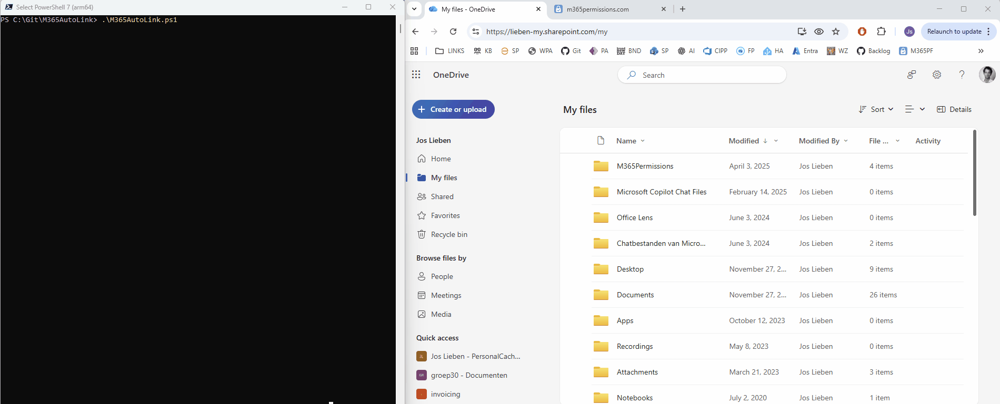
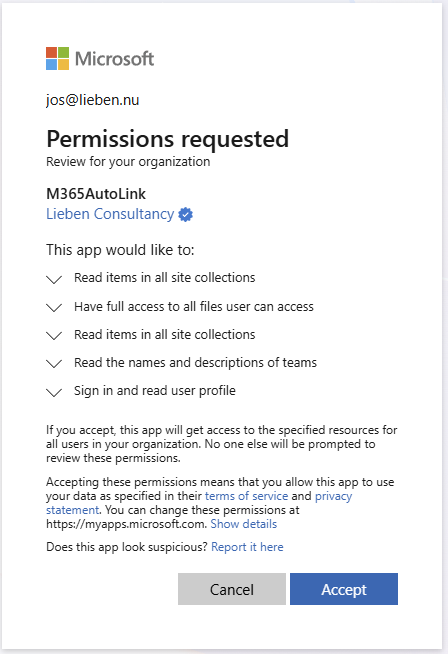

# M365AutoLink
M365AutoLink automatically finds all Microsoft Teams and SharePoint sites you have access to and creates shortcuts to them in your OneDrive, making them available in your file explorer.



# Features
- **Saves Time**: Instantly links all your collaborative spaces to your OneDrive.
- **Organization**: Creates a dedicated folder (default: "Entire Organization") in your OneDrive root for all shortcuts.
- **Silent Operation**: Caches authentication tokens so subsequent runs can happen silently in the background.
- **Smart Filtering**: Includes configuration to exclude specific site patterns (e.g. personal sites).

# Usage

## Quick Start
1. Download the script [`M365AutoLink.ps1`](https://github.com/jflieben/M365AutoLink/blob/main/M365AutoLink.ps1).
2. [Grant Consent](https://login.microsoftonline.com/organizations/adminconsent?client_id=ae7727e4-0471-4690-b155-76cbf5fdcb30) to the SSO app registration
3. Open a PowerShell terminal (PowerShell 5.x or 7.x).
4. Run the script: 
   ```powershell
   .\M365AutoLink.ps1
   ```
5. Wait for the Onedrive client to sync down the new links

## Configuration
You can edit the `##########START CONFIGURATION##########` block at the top of the script to customize:
- `$FolderName`: The name of the folder created in OneDrive (Default: "Entire Organization").
- `$excludedSitesByWildcard`: Patterns for sites to skip.
- `$includedSitesByWildcard`: Patterns for sites to include.

# Authentication & Permissions
The script uses Microsoft Graph APIs to discover sites and create shortcuts. 

## Automatic App Registration
You can consent to the "Lieben Consultancy" multi-tenant app:
[Grant Consent](https://login.microsoftonline.com/organizations/adminconsent?client_id=ae7727e4-0471-4690-b155-76cbf5fdcb30)

## Manual App Registration
Create your own App Registration in Azure AD:
1. Create a new App Registration ("Mobile and desktop applications").
2. Set Redirect URI to `http://localhost`.
3. Enable "Allow public client flows".
4. Replace the `$ClientID` variable in the script with your new Application (Client) ID.

## Required Permissions
The script requires the following delegated permissions to function:
- `Files.ReadWrite.All`: To create shortcuts in OneDrive.
- `Team.ReadBasic.All`: To find Teams you are a member of.
- `Sites.Read.All`: To find SharePoint sites you have access to.



# Copyright/License
https://www.lieben.nu/liebensraum/commercial-use/
(Commercial (re)use not allowed without prior written consent by the author, otherwise free to use/modify as long as headers are kept intact)

# Support / Risk
Support at best-effort, use at your own risk.
When reporting issues, please include `lastRun.log` from `%APPDATA%\M365AutoLink\`.

# Author
Jos Lieben (https://www.lieben.nu)