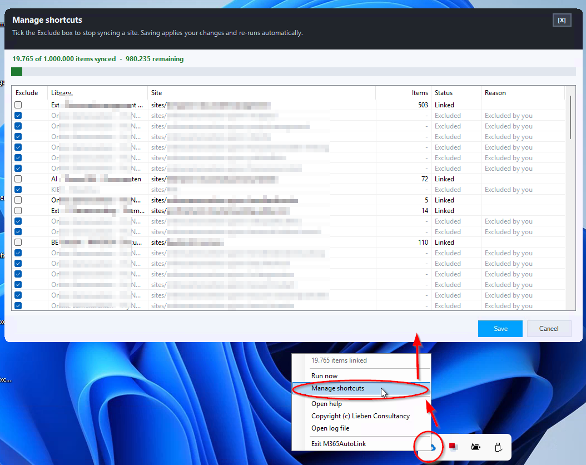

# M365AutoLink

M365AutoLink automatically finds every Microsoft Teams and SharePoint document library you have access to and creates shortcuts to them in your OneDrive, so they show up in File Explorer like any other folder.

This script (`M365AutoLink.ps1`) runs **as the signed-in user** (delegated authentication). It is meant to be run as logon script, shortcut or scheduled task.

> **Need to roll this out centrally, for many users, without anyone signing in?**
> There is a server-side admin version that runs with a Managed Identity or certificate and processes any/all users from Azure Automation, an Azure Function, or a scheduled task. See **[README_Centralized.md](README_Centralized.md)**. That version won't scale well beyond a few hundred users.


## Features
- **Legacy App Support** allows legacy apps to find and use the files you migrated to Microsoft 365
- **Saves time**: instantly links all your collaborative spaces into your OneDrive.
- **Organized**: creates a single dedicated folder (default: `AutoLink`) in your OneDrive root for all shortcuts.
- **Silent after first run**: caches the refresh token so subsequent runs happen silently in the background.
- **Smart filtering**: include/exclude SharePoint sites by URL wildcard, and skip system libraries automatically.
- **Permission-aware**: only links libraries you can actually access; obsolete shortcuts are removed when you lose access.
- **Self-service shortcut management**: a built-in **Manage shortcuts** window lets you see every linked library and exclude the ones you don't want. Changes save to OneDrive and apply across your devices.
- **Sync-budget awareness**: tracks the total number of items across all linked libraries and warns you (tray icon, tooltip, capacity bar) as you approach the point where Windows Explorer/OneDrive sync becomes unreliable.
- **Tray workflow**: optional system tray icon keeps the script alive so you can re-run it, manage shortcuts, or open the log without restarting.
- **Floating progress bar**: an optional bottom-right progress indicator shows what the script is doing.
- **Launch persistence**: optionally create Desktop / Start Menu shortcuts, or run automatically at logon.
- **Dry-run support**: preview every create/rename/delete action without touching OneDrive.
- **Safety filtering**: automatically skips libraries that require check-out, plus system/hidden libraries that don't work well as shortcuts.
- **Deletion safety**: a circuit breaker skips mass deletion when SharePoint Search returns partial results, so a transient index hiccup never wipes your shortcuts.
- **Periodic auto-refresh**: optionally re-run every few hours (and after sleep) so access changes appear without re-logon.
- **Fleet-friendly**: layered external configuration (JSON file or registry policy) and an Intune bootstrap path: no need to edit the script per customer.

See the [changelog](CHANGELOG.md) for what changed between versions.

---

## Quick Start
1. Download [`M365AutoLink.ps1`](https://github.com/jflieben/M365AutoLink/blob/main/M365AutoLink.ps1).
2. Have an admin [grant consent](https://login.microsoftonline.com/organizations/adminconsent?client_id=ae7727e4-0471-4690-b155-76cbf5fdcb30) to the SSO app registration (one-time, tenant-wide), or use your own app registration (see [Authentication & Permissions](#authentication--permissions)).
3. Open a PowerShell terminal (PowerShell 5.x or 7.x).
4. Run the script:
   ```powershell
   .\M365AutoLink.ps1
   ```
5. Sign in if prompted (first run only). After that, runs are silent.
6. Wait for the OneDrive client to sync the new shortcuts down to File Explorer.

If tray mode is enabled (the default), the script stays in the system tray after the first run. Right-click the tray icon to **Run now**, open **Manage shortcuts**, open the log, get help, or exit.

## How It Works
1. Authenticates to Microsoft Graph using your cached refresh token if available, else silent browser or else interactive browser, (first time only).
2. Uses SharePoint Search to find every document library you have access to (this is why a site must not be excluded from search to be linked).
3. Applies your include/exclude wildcards, file-count limits, and the system-library exclusions.
4. Creates/renames/deletes OneDrive shortcuts in the `AutoLink` folder so they match exactly what you currently have access to.

---

## Manage Shortcuts

Right-click the tray icon and choose **Manage shortcuts** to open the self-service window. It lists every library the last run considered, with its item count and current status (**Linked** or **Excluded**). Tick the **Exclude** box on any library to stop syncing it; untick to bring it back.



- The **capacity bar** at the top shows how many items your currently-included libraries add up to, against the recommended ~1,000,000-item budget. It turns amber as you approach the limit and red once you go over.
- Exclusions are saved to your OneDrive (`Apps/M365AutoLink/config.json`), so they follow you to every device where you run the script.
- **Saving re-runs the script automatically** to apply your changes immediately.

This replaces the older separate "exclude site" / "view shortcuts" tray actions — both are now handled in this one window, at the individual-library level.

## Configuration
Edit the `##########START CONFIGURATION##########` block at the top of the script.

### Common settings
| Variable | Description | Default |
|---|---|---|
| `$FolderName` | Name of the OneDrive folder that houses all shortcuts (auto-created). | `"AutoLink"` |
| `$CloudType` | Cloud environment: `global`, `usgov`, `usdod`, `china`. | `"global"` |
| `$ClientID` | App registration (public client) ID used for authentication. | Lieben Consultancy app |
| `$DryRun` | Preview mode — no shortcuts are created, renamed, or deleted. | `$false` |
| `$excludedSitesByWildcard` | URL patterns to **skip** (`*` matches one or more characters). | *(curated default list)* |
| `$includedSitesByWildcard` | URL patterns to **include** — if set, only matching sites are linked. | `"https://*.sharepoint.com/sites/*"` |
| `$maxFileCount` | Only link a library with fewer than this many files. | `300000` |
| `$minFileCount` | Only link a library with more than this many files. | `0` |
| `$linkNameReplacements` | Find/replace patterns applied to shortcut names (see [Link Name Cleanup](#link-name-cleanup)). | *(see script)* |

> **Note:** any pre-existing sub-folders inside `$FolderName` will be removed — keep that folder dedicated to M365AutoLink.

### Sync-budget warnings
| Variable | Description | Default |
|---|---|---|
| `$totalItemCountWarningThreshold` | Combined item count across all linked libraries at which the tool shows a red "over limit" warning. | `1000000` |
| `$totalItemCountWarningRatio` | Fraction of the threshold at which the amber "approaching" warning appears. | `0.9` |
| `$ItemCountHelpLink` | Knowledgebase article opened from the over/approaching-limit notification. | lieben.nu article |

These only **warn** — the tool never blocks you from going over the limit.

### UI / tray / progress
| Variable | Description | Default |
|---|---|---|
| `$ShowProgressBar` | Show the floating bottom-right progress bar. | `$true` |
| `$ProgressBarColor` / `$ProgressBarText` | Color and caption of the progress bar. | blue / "updating your shortcuts…" |
| `$EnableSystemTrayIcon` | Show the system tray icon and its menu. | `$true` |
| `$KeepRunningInTray` | Keep the process alive after a run so tray actions (Run now, Manage shortcuts) stay available. | `$true` |
| `$WindowStyle` | Browser window style during sign-in (`Normal`, `Hidden`, `Minimized`, `Maximized`). | `"Normal"` |
| `$TrayHelpLink` | URL opened by the tray **Open help** action. | Microsoft KB article |
| `$TrayCopyrightText` / `$TrayCopyrightLink` | Text and link of the copyright entry in the tray menu. | Lieben Consultancy |
| `$LaunchModes` | Persistence options: any of `Desktop`, `Start Menu`, `AtLogon` (see below). | `@('AtLogon')` |

> ⚠️ **`$WindowStyle = "Hidden"` trap:** a hidden browser window makes **first-run interactive sign-in impossible** (the user can't complete sign-in they can't see). Only use `Hidden` when silent SSO is guaranteed (e.g. Entra-joined devices with seamless SSO). Leave it `Normal` for anything that might need an interactive first sign-in.

### Deployment settings
| Variable | Description | Default |
|---|---|---|
| `$deployToPath` | Permanent location the script copies itself to on first run. **Required for Intune** (the temporary Intune location is deleted right after execution, which would break persistence). Accepts a full `.ps1` path or a folder; supports `$env:NAME` and `%NAME%`. Leave `$Null` to run/persist from the current location. | `$Null` |
| `$Uninstall` | When `$true`, removes **all** persistence, the deployed copy, the token cache and the log, then exits (see [Uninstalling](#uninstalling)). | `$false` |
| `$DeviceNameIncludeFilter` | Only run on devices whose name contains this string. `$Null` = run everywhere it's deployed. | `$Null` |

### Reliability & maintenance settings
| Variable | Description | Default |
|---|---|---|
| `$AutoRefreshHours` | When `> 0`, auto-runs every N hours while resident in the tray (plus shortly after the device resumes from sleep). `0` = only logon + manual. Requires `$KeepRunningInTray`. | `0` |
| `$DeletionSafetyRatio` | Deletion circuit breaker: skip the whole delete phase if the desired set shrank by more than this fraction vs. the last successful run (protects against a partial SharePoint Search outage causing mass deletion). `1` disables the ratio guard. | `0.40` |
| `$LogHistoryCount` | How many timestamped previous run logs (`run-<timestamp>.log`) to keep beside `lastRun.log`. | `5` |

### System-library exclusions
The script never turns system/hidden libraries (Style Library, Site Assets, Site Pages, Form Templates, Preservation Hold Library, etc.) into shortcuts. These are controlled by `$excludedLibrariesByWildcard`, `$ExcludedListTitles`, and `$ExcludedListFeatureIDs` — only edit these if you know what you're doing.

> **Wildcard matching note:** include/exclude patterns use PowerShell's `-like` operator. A `*` matches zero or more characters, and matching is anchored at **both** ends — so a trailing `*` is required for prefix matching (e.g. use `*/sites/HR*`, not `*/sites/HR`, to exclude everything under `/sites/HR`).

## External configuration (manage without editing the script)
Because every script update overwrites the configuration block, admins can supply settings **outside** the script. Sources are checked in this order (first match wins per setting), falling back to the in-script default so zero-config still works:

1. `HKLM\Software\Policies\Lieben\M365AutoLink` (Intune Settings Catalog / registry CSP / GPO — lockable)
2. `HKCU\Software\Policies\Lieben\M365AutoLink`
3. `M365AutoLink.config.json` next to the script (survives script updates)
4. the in-script default

Example `M365AutoLink.config.json`:
```json
{
  "FolderName": "Company Links",
  "LaunchModes": ["AtLogon"],
  "deployToPath": "%APPDATA%\\M365AutoLink\\M365AutoLink.ps1",
  "AutoRefreshHours": 8,
  "excludedSitesByWildcard": ["*/personal/*", "*/sites/AppCatalog*"]
}
```
Overridable keys include: `FolderName`, `CloudType`, `ClientID`, `WindowStyle`, `DryRun`, `LaunchModes`, `deployToPath`, `Uninstall`, `excludedSitesByWildcard`, `includedSitesByWildcard`, `maxFileCount`, `minFileCount`, `totalItemCountWarningThreshold`, `ShowProgressBar`, `EnableSystemTrayIcon`, `KeepRunningInTray`, `DeviceNameIncludeFilter`, `AutoRefreshHours`, `DeletionSafetyRatio`, `LogHistoryCount`.

### Registry-based configuration

The same keys can be set under `HKLM\Software\Policies\Lieben\M365AutoLink` (machine-wide, lockable, most authoritative) or `HKCU\Software\Policies\Lieben\M365AutoLink` (per-user). The value name matches the setting name exactly. Value types are coerced to the setting's type, so:

- **Text** settings (`deployToPath`, `FolderName`, `CloudType`, `WindowStyle`, `DeviceNameIncludeFilter`) → `REG_SZ`.
- **Number** settings (`AutoRefreshHours`, `maxFileCount`, `LogHistoryCount`, `totalItemCountWarningThreshold`) → `REG_DWORD` (or `REG_SZ`).
- **On/off** settings (`DryRun`, `ShowProgressBar`, `EnableSystemTrayIcon`, `KeepRunningInTray`, `Uninstall`) → `REG_DWORD` `1`/`0`, or `REG_SZ` `true`/`false`.
- **List** settings (`excludedSitesByWildcard`, `includedSitesByWildcard`, `LaunchModes`) → `REG_MULTI_SZ` (one pattern per line).

**Example 1 — set the deploy path and folder name (PowerShell, machine policy):**
```powershell
$key = 'HKLM:\Software\Policies\Lieben\M365AutoLink'
New-Item -Path $key -Force | Out-Null
New-ItemProperty -Path $key -Name 'deployToPath' -Value '%APPDATA%\M365AutoLink\M365AutoLink.ps1' -PropertyType String -Force
New-ItemProperty -Path $key -Name 'FolderName'   -Value 'Company Links' -PropertyType String -Force
```

**Example 2 — exclude sites by wildcard (`REG_MULTI_SZ`, one pattern per line):**
```powershell
$key = 'HKLM:\Software\Policies\Lieben\M365AutoLink'
New-ItemProperty -Path $key -Name 'excludedSitesByWildcard' -PropertyType MultiString -Force -Value @(
    '*/personal/*'
    '*/sites/AppCatalog*'
    '*/sites/TeamTemplates*'
)
```

**Example 3 — enable 8-hour auto-refresh and turn on dry-run (numbers/booleans):**
```powershell
$key = 'HKLM:\Software\Policies\Lieben\M365AutoLink'
New-ItemProperty -Path $key -Name 'AutoRefreshHours' -Value 8 -PropertyType DWord  -Force
New-ItemProperty -Path $key -Name 'DryRun'           -Value 1 -PropertyType DWord  -Force   # or REG_SZ "true"
```

**Example 4 — a `.reg` file (scalar values; multi-string is easiest via PowerShell above):**
```reg
Windows Registry Editor Version 5.00

[HKEY_LOCAL_MACHINE\SOFTWARE\Policies\Lieben\M365AutoLink]
"deployToPath"="%APPDATA%\\M365AutoLink\\M365AutoLink.ps1"
"FolderName"="Company Links"
"AutoRefreshHours"=dword:00000008
"DryRun"="false"
```

These keys are ideal for Intune (Settings Catalog registry / the OMA-URI `./Device/Vendor/MSFT/Registry/...`, or a remediation script) or Group Policy Preferences — the script reads them on every run, so changes apply without repackaging.

## Launch Persistence
`$LaunchModes` controls how the script can re-launch itself:
- **`AtLogon`** — registers a scheduled task (falling back to a `Run` key or Startup-folder shortcut) so M365AutoLink runs automatically each time you sign in.
- **`Desktop`** — creates a Desktop shortcut.
- **`Start Menu`** — creates a Start Menu shortcut.

Set `$LaunchModes = @()` to disable all persistence. Removing a mode also removes the shortcut/task it created on the next run.

---

## Deploying with Intune

M365AutoLink is designed to be deployed per-user via Intune. Because it **runs as the signed-in user** (delegated auth) and stays resident in the tray, there are two things to get right:

1. **Run in the user's context**, not SYSTEM (delegated auth + OneDrive are per-user).
2. **Set `$deployToPath`** to a permanent per-user path (e.g. `%APPDATA%\M365AutoLink\M365AutoLink.ps1`). Intune stages scripts in a temporary folder that is deleted right after execution — without `$deployToPath`, any persistence (scheduled task / shortcuts) would point at a path that no longer exists.

When Intune runs the script, M365AutoLink detects the Intune context, copies itself to `$deployToPath`, applies persistence, launches a **detached** run (owned by the WMI provider host so it survives Intune's process/timeout), and then exits immediately — so Intune records a fast, successful execution while the user still gets the tray icon and shortcuts.

### Option A — Platform script (simplest)
Intune admin center → **Devices → Scripts and remediations → Platform scripts → Add (Windows 10 and later)**:
- Upload `M365AutoLink.ps1` (with `$deployToPath` set, ideally via `M365AutoLink.config.json`/registry policy instead of editing the script).
- **Run this script using the logged-on credentials** = **Yes**.
- **Enforce script signature check** = No (unless you sign it).
- **Run script in 64-bit PowerShell** = Yes.

### Option B — Win32 app (more control: detection, uninstall, supersedence)
Package the script with the [Win32 Content Prep Tool](https://learn.microsoft.com/mem/intune/apps/apps-win32-prepare) and configure:
- **Install command:** `powershell.exe -NoProfile -ExecutionPolicy Bypass -File M365AutoLink.ps1`
- **Uninstall command:** `powershell.exe -NoProfile -ExecutionPolicy Bypass -File M365AutoLink.ps1 -Uninstall` *(or ship a config/registry policy with `Uninstall=true`)*
- **Install behavior:** User
- **Detection rule:** file exists at your `$deployToPath` (e.g. `%APPDATA%\M365AutoLink\M365AutoLink.ps1`).

### Managing settings without editing the script
Prefer the [external configuration](#external-configuration-manage-without-editing-the-script) (`M365AutoLink.config.json` or the `...\Policies\Lieben\M365AutoLink` registry keys) so you can update `$deployToPath`, exclusions, etc. via Intune without repackaging — and so a script update never clobbers customer configuration.

### AppLocker / WDAC environments
The at-logon task launches a user-writable `.ps1` with `-ExecutionPolicy Bypass`, which some EDR/AppLocker policies flag. For locked-down fleets, deploy a per-machine copy under `Program Files` (run via Intune) with a per-user scheduled task, and/or Authenticode-sign the script.

---

## Uninstalling
Run the script once with `$Uninstall = $true` (or set `Uninstall=true` via external config, or use the Win32 uninstall command above). This removes the scheduled task / Run key / Startup shortcut, the Desktop and Start Menu shortcuts, the deployed script copy, **and the cached refresh token + log**. It does **not** delete the shortcuts already created in your OneDrive or the `Apps/M365AutoLink/config.json` — delete those manually if desired.

---

## Authentication & Permissions

### Option 1 — Use the Lieben Consultancy app (easiest)
Have an admin consent to the multi-tenant public client app:
[Grant Consent](https://login.microsoftonline.com/organizations/adminconsent?client_id=ae7727e4-0471-4690-b155-76cbf5fdcb30)

These are **delegated** permissions only — the app can never act outside the signed-in user's own access, and Lieben Consultancy cannot access your data. The app registration is used purely for OAuth.


### Option 2 — Your own app registration
If you'd rather not use the shared app, create your own public client App Registration in Entra ID:
1. App registrations → New registration.
2. Authentication → Add a platform → **Mobile and desktop applications**.
3. Add redirect URI `http://localhost` and check `https://login.microsoftonline.com/common/oauth2/nativeclient`. (The script listens on a loopback port for the sign-in callback.)
4. Enable **Allow public client flows**.
5. Add and grant the delegated permissions below.
6. Set `$ClientID` in the script to your Application (client) ID.

### Required Permissions (Delegated)
**Microsoft Graph**
- `Files.ReadWrite.All` — create shortcuts in your OneDrive.
- `Sites.Read.All` — discover the SharePoint sites you have access to.
- `User.Read` — sign you in.

**SharePoint**
- `AllSites.Read` — read library metadata and run the search query that finds your libraries.

Your app registration's permissions should look like this:


> If a site has been **excluded from Search** (Settings → Search and offline availability), it won't be found regardless of your filters.
> 

---

## Link Name Cleanup
`$linkNameReplacements` tidies up shortcut names. Each entry has a `Pattern` (text to find) and a `Replacement`. Patterns are applied in order and the final name is trimmed.

```powershell
$linkNameReplacements = @(
    @{ Pattern = " - Documents"; Replacement = "" }
    @{ Pattern = "- Documents"; Replacement = "" }
    @{ Pattern = "- Documenten"; Replacement = "" }
)
```

This turns `Marketing - Documents` into `Marketing`. Renaming also applies to existing shortcuts on each run, so changing these patterns updates shortcuts you already have.

## Copyright / License
https://www.lieben.nu/liebensraum/commercial-use/
(Commercial (re)use is not allowed without prior written consent by the author; otherwise free to use/modify as long as headers are kept intact.)

## Troubleshooting

| Symptom | Likely cause | Fix |
|---|---|---|
| A site/library is never linked | The site is **excluded from Search**, or its content was only recently added (search index delay). | Check **Settings → Site → Search and offline availability** (`/_layouts/15/srchvis.aspx`); wait for the index to catch up for brand-new sites. |
| Shortcuts are created but never appear in File Explorer | OneDrive isn't signed in / syncing a work account on the device. | Sign OneDrive into the work account; the pre-flight check warns about this in a tray balloon. |
| A library shows as a **folder** full of files instead of a shortcut | The library became sync-blocked; OneDrive converted the shortcut to a folder. | The next run detects and removes these automatically. |
| "Approaching/over limit" warning (amber/red tray icon) | Combined item count across linked libraries is near the ~1,000,000 sync budget. | Exclude large libraries in **Manage shortcuts**; see the linked KB article. |
| Some libraries are missing and you're a guest/B2B user | Guest accounts often can't run SharePoint Search in the host tenant. | Expected limitation; link those manually via OneDrive. |
| Sign-in never completes / no browser appears | `$WindowStyle = "Hidden"` on a device without silent SSO. | Set `$WindowStyle = "Normal"`. |
| "needs admin consent" balloon | The app registration hasn't been admin-consented in your tenant. | Have an admin [grant consent](https://login.microsoftonline.com/organizations/adminconsent?client_id=ae7727e4-0471-4690-b155-76cbf5fdcb30). |
| Behind a corporate proxy, nothing works | The identity provider or Graph is unreachable. | Configure the proxy for the user; the pre-flight check reports IdP reachability. |
| `Restricted Content` (Copilot) sites not found | Restricted Content limits discoverability. | Expected; disable Restricted Content on the site if links are required. |

## Support / Risk
Best-effort support, use at your own risk.
When reporting issues on GitHub, please include `lastRun.log` (and the rotated `run-*.log` files) from `%APPDATA%\M365AutoLink\`, and confirm the site is browsable, not excluded from Search, and not already synced another way.

## Author
Jos Lieben — https://www.lieben.nu
